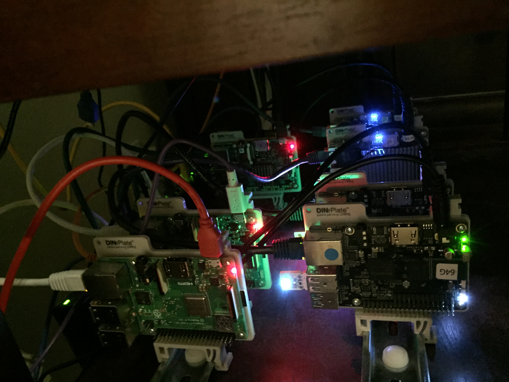
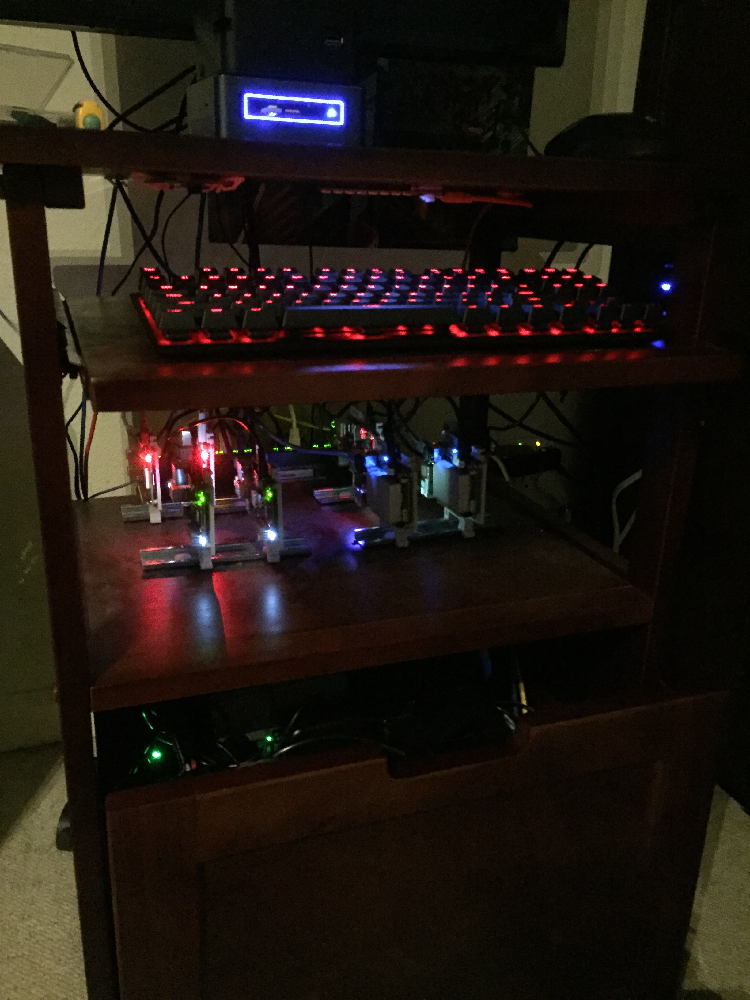

# Cascadia

### setup steps

* [RaspberryPi](setup/RaspberryPi)
* [Rock64](setup/Rock64)
* [Up boards](setup/UpBoard)
* [Intel NUC](setup/NUC)
    
### typical usage

Cascadia will not start automatically after reboots. To start it:

    cd ~/cascadia/runtime
    ./cascadia.sh start

To monitor output/progress:

    ./cascadia.sh
    ./cascadia.sh status
    tail -f cascadia.log

To stop Cascadia:

    ./cascadia.sh stop

